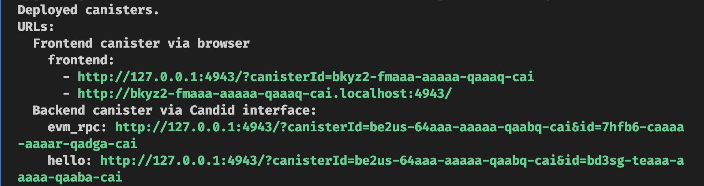

# Building a Cross-Chain ETH Payment and E-Commerce Platform on the Internet Computer: A Step-by-Step Tutorial

## Introduction

This comprehensive tutorial guides you through the process of building a decentralized e-commerce platform on the Internet Computer that can accept Ethereum (ETH) payments, handle withdrawals, and manage a digital storefront. Starting from a basic template, we'll incrementally add features to create a robust, cross-chain solution.

## Why I Made This Tutorial?

This tutorial is a hands-on guide designed for developers new to the Internet Computer blockchain. I've created a set of libraries to make development easier and more enjoyable, and this tutorial walks you through the process of building a decentralized ETH payment system using these libraries.

We'll explore key features like HTTP outcalls and stable memory, providing a solid foundation for anyone looking to bring their dream project to life on the Internet Computer. Although this tutorial uses my specific set of methods and libraries, there are many other tools and techniques you could use.

For example, you could integrate the [`ic-eth-rpc`](https://github.com/internet-computer-protocol/ic-eth-rpc) package for Ethereum RPC calls or accept ckETH as a payment method. The main goal here is to demonstrate the Internet Computer's flexibility and ease of use, especially when it comes to confirming transactions on-chain.

## Objective

The goal of this tutorial is to create a fully functional decentralized e-commerce platform that:

- Accepts ETH as payment for digital items
- Integrates with Ethereum smart contracts for payment processing.
- Verifies transactions on-chain for added security
- Allows for the withdrawal of ETH to an Ethereum address
- Utilizes stable memory to keep track of transactions and items.
- Manages a digital storefront with items for sale
- Implements access control to secure sensitive operations

## Final Product(YouTube Video)

[](https://youtu.be/lPNOqKwPRlE)

## Prerequisites

- [DFINITY Canister SDK](https://sdk.dfinity.org/docs/quickstart/local-quickstart.html)
- [Node.js](https://nodejs.org/en/download/)
- [Rust](https://www.rust-lang.org/tools/install)
- Basic understanding of Ethereum and smart contracts

## Step 1: Clone the Starter Repository and Run the Project Locally

We'll begin by cloning the [`ic-rust-nextjs`](https://github.com/b3hr4d/ic-rust-nextjs) repository, which serves as our starter template.

### What's Inside the Starter Repository?

- [`README.md`](https://github.com/b3hr4d/ic-rust-nextjs/blob/main/README.md): Provides an overview and setup instructions.
- [`Cargo.toml`](https://github.com/b3hr4d/ic-rust-nextjs/blob/main/Cargo.toml): The manifest file for the Rust workspace.
- [`dfx.json`](https://github.com/b3hr4d/ic-rust-nextjs/blob/main/dfx.json): Configuration file for the DFINITY Canister SDK.
- [`backend/hello/src/lib.rs`](https://github.com/b3hr4d/ic-rust-nextjs/blob/main/backend/hello/src/lib.rs): The Rust code for the backend logic.
- [`src/pages/index.tsx`](https://github.com/b3hr4d/ic-rust-nextjs/blob/main/src/pages/index.tsx): The main page of the Next.js app.
- [`src/service/hello.ts`](https://github.com/b3hr4d/ic-rust-nextjs/blob/main/src/service/hello.ts): Service file to interact with the Rust backend.

### Cloning the Repository

To clone the repository, open your terminal and run:

```bash
git clone https://github.com/b3hr4d/ic-rust-nextjs.git
```

### Running the Project Locally

After cloning the repository, the next step is to run the project locally to ensure everything is set up correctly. Follow the commands below based on your package manager (Yarn or npm).

### Installing Dependencies

First, let's install all the required dependencies:

```bash
yarn install:all
# or
npm run install:all
```

### Running Local Internet Computer

To start the local Internet Computer environment, run:

```bash
yarn dfx:start
# or
npm run dfx:start
```

### Deploying to the Local Internet Computer

Deploy your the backend canister to the local Internet Computer by running:

```bash
yarn deploy payment
# or
npm run deploy payment
```

### Running the Next.js App

Finally, to run the Next.js(frontend) app, execute:

```bash
yarn dev
# or
npm run dev
```

Open your browser and navigate to [http://localhost:3000](http://localhost:3000) to see your app running.


## Step 1.1: Rename the Canister ID

In this step, we'll rename the canister ID to make it easier to reference in the code.

### Renaming the Canister ID

To rename the default project name and canister name from "hello" to "payment", follow these steps:

1. Open the `Cargo.toml` file in the "backend/hello" directory.

2. Find the line that says `name = "hello"` and change it to `name = "payment"`.

3. Save the file.

4. Next, open the `dfx.json` file in the root directory of your project.

5. Find the line that says `"hello": {` and change it to `"payment": {`.

6. Inside the `"payment"` object change "package" from `"hello"` to `"payment"` and candid from `"backend/hello/hello.did"` to `"backend/payment/payment.did"`.

7. Save the file.

8. Rename the directory `backend/hello` to `backend/payment`.

9. Open the `Cargo.toml` file in the root directory again.

10. Find the line that says `members = ["backend/hello"]` and change it to `members = ["backend/payment"]`.

11. Save the file.

12. Open the `payment` directory and locate the `hello.did` file.

13. Ensure that the `.did` file is named `payment.did`.

14. Save any changes if necessary.

With these changes, your project and canister will now be named "payment" instead of "hello".

## Step 2: Modify the Backend for ETH Deposits

In this step, we'll modify the backend to include a function that generates a deposit principal from a canister ID. This is essential for converting SepoliaETH into ckSepoliaETH, as per the ckEth documentation.

### Installing the `b3_utils` Rust Crate

First, we need to install the [b3_utils](https://docs.rs/b3_utils/latest/b3_utils/) Rust crate. Open your `Cargo.toml` file and add the following line under `[dependencies]`:

```toml
b3_utils = "0.11.0"
```

or run this command:

```bash
cargo add b3_utils
```

### Modifying the `greet` Function

Replace the existing `greet` function with the new `deposit_principal` function:

```rust
use b3_utils::{vec_to_hex_string_with_0x, Subaccount};
use candid::Principal;

#[ic_cdk::query]
fn deposit_principal(principal: String) -> String {
    let principal = Principal::from_text(principal).unwrap();
    let subaccount = Subaccount::from_principal(principal);

    let bytes32 = subaccount.to_bytes32().unwrap();

    vec_to_hex_string_with_0x(bytes32)
}
```

#### Why This Change?

1. **Function Annotation**: We use `#[ic_cdk::query]` to indicate that this is a query method, meaning it's read-only and doesn't modify the state.

2. **Principal Conversion**: We convert the passed string into a `Principal` object, which is essential for generating a subaccount.

3. **Subaccount Generation**: We generate a `Subaccount` from the `Principal`, which is a necessary step for depositing ETH.

4. **Bytes32 Conversion**: We convert the subaccount into a bytes32 array, which is the required format for the smart contract on the Sepolia Ethereum testnet.

5. **Hex String**: Finally, we convert the bytes32 array into a hex string with a "0x" prefix, which can be used as an argument for the smart contract.

### Deploy the Modified Backend Canister

After making the changes to the backend, open another terminal and deploy the canister to your local Internet Computer environment using the following command:

```bash
yarn deploy payment
```

Note: confirm the consent with `yes` to the change on the terminal.

This will deploy only the `payment` canister, which now includes the `deposit_principal` function.

### Update the Frontend Code

Navigate to the frontend code where the `useQueryCall` hook is used. This is typically found in a component file. Change the method from `"greet"` to `"deposit_principal"`:

```javascript
const { call, data, error, loading } = useQueryCall({
  functionName: "deposit_principal"
})
```

#### Testing the Changes

1. **Pass the Canister ID**: Update the frontend to include an input field where you can enter the canister ID.

2. **Check the Output**: The output should be a hexadecimal string that represents the deposit principal, which can be used for depositing ETH.


## Step 3: Integrate MetaMask and Call the Minter Helper Contract

In this step, we'll integrate MetaMask using the [wagmi](https://wagmi.sh) library and set up the frontend to call the minter helper contract's deposit function.

### Prerequisites

- Make sure you have the [MetaMask extension](https://metamask.io/download.html) installed in your browser.

### Installing `wagmi` and `viem`

First, install the `wagmi` and `viem` packages:

```bash
yarn add wagmi viem
```

### Configure `wagmi`

Create a new file `config.ts` inside the `src/service` directory and add the following code:

```javascript
import { createPublicClient, http } from "viem"
import { createConfig, sepolia } from "wagmi"

export const config = createConfig({
  chains: [sepolia],
  connectors: [injected()],
  client({ chain }) {
    return createClient({ chain, transport: http() })
  }
})
```

### Create the `Wallet` Component

Create a new file named `Wallet.tsx` inside the `src/components` folder and add the following code:

```javascript
import { useAccount, useConnect, useDisconnect } from "wagmi"
import { MetaMaskConnector } from "wagmi/connectors/metaMask"

interface WalletProps {}

const Wallet: React.FC<WalletProps> = ({}) => {
  const { address } = useAccount()

  const { connect } = useConnect({
    connector: new MetaMaskConnector()
  })

  const { disconnect } = useDisconnect()

  if (address)
    return (
      <main>
        Connected to: {address}
        <br />
        <button onClick={() => disconnect()}>Disconnect</button>
      </main>
    )
  return <button onClick={() => connect()}>Connect Wallet</button>
}

export default Wallet
```

### Update `index.tsx`

Finally, update your `src/pages/index.tsx` file and replace `<Greeting />` with the following code`:

```javascript
// ...existing imports
import Wallet from "../components/Wallet"
import { config } from "service/config"
import { WagmiConfig } from "wagmi"

function HomePage() {
  return (
    {/* ...existing components */}
    {/* <Greeting /> */}
    <WagmiConfig config={config}>
      <Wallet />
    </WagmiConfig>
    {/* ...existing components */}
  )
}
```

#### Testing the Changes

You should see a "Connect Wallet" button on your browser, similar to the screenshot below.


Clicking on the button should open a MetaMask popup asking for permission to connect. After connecting, you should see your wallet address on the screen.

## Step 4: Prepare Minter Helper Contract and Enable Deposits

In this step, we'll prepare the minter helper contract for calls and enable ETH deposits through the frontend.

### Fetch Contract ABI

1. **Navigate to Etherscan**: Open the [contract page on Sepolia Etherscan](https://sepolia.etherscan.io/address/0xb44B5e756A894775FC32EDdf3314Bb1B1944dC34#code).

2. **Copy Contract ABI**: Copy the Contract ABI from the "Contract" tab.
   

3. **Create `abi.json`**: Inside the `src/service` directory, create a new file named `abi.json` and paste the copied ABI.

### Create the `Deposit` Component

Create a new file named `Deposit.tsx` inside the `src/components` directory and add the following code:

```javascript
import { canisterId } from "declarations/payment"
import { useEffect, useState } from "react"
import helperAbi from "service/abi.json"
import { useQueryCall } from "service/payment"
import { parseEther } from "viem"
import { useContractWrite } from "wagmi"

interface DepositProps {}

const Deposit: React.FC<DepositProps> = ({}) => {
  const [amount, setAmount] = useState(0)

  const { data: canisterDepositAddress } = useQueryCall({
    functionName: "deposit_principal"
  })

  useEffect(() => {
    call(canisterId)
  }, [])

  const { data, isLoading, write } = useContractWrite({
    address: "0xb44B5e756A894775FC32EDdf3314Bb1B1944dC34",
    abi: helperAbi,
    functionName: "deposit",
    value: parseEther(amount.toString()),
    args: [canisterDepositAddress]
  })

  const changeHandler = (e: React.ChangeEvent<HTMLInputElement>) => {
    let amount = e.target.valueAsNumber
    if (Number.isNaN(amount) || amount < 0) amount = 0

    setAmount(amount)
  }

  if (isLoading) {
    return <div>Loading...</div>
  } else if (data?.hash) {
    return <div>Transaction Hash: {data.hash}</div>
  } else {
    return (
      <div>
        <input type="number" value={amount} onChange={changeHandler} />
        <button onClick={() => write()}>Deposit</button>
      </div>
    )
  }
}

export default Deposit
```

#### Understanding `useContractWrite`

The `useContractWrite` hook is used to interact with Ethereum smart contracts. Here's what each parameter does:

- **`address`**: The Ethereum address of the contract you want to interact with.
- **`abi`**: The ABI (Application Binary Interface) of the contract, which is a JSON representation of the contract's methods and structures.
- **`functionName`**: The name of the function in the contract that you want to call.
- **`value`**: The amount of ETH to send along with the function call, converted to its smallest unit (wei) using `parseEther`.
- **`args`**: An array of arguments that the function takes. In this case, it's the deposit address generated by the canister.

### Update the `Wallet` Component

Add the `<Deposit />` component to the `Wallet.tsx` file, right above the "Disconnect" button:

```javascript
// ...existing code
return (
  <main>
    Connected to: {address}
    <br />
    <Deposit />
    <br />
    <button onClick={() => disconnect()}>Disconnect</button>
  </main>
)
```

#### Testing the Changes

You should have small amount of Sepolia ETH in your wallet. you can get some using this [faucet](https://sepoliafaucet.com/).

1. **Call the Deposit Function**: Please make sure you are on the Sepolia network on the metamask then Use the new deposit input and button to initiate a deposit.
   
2. **Confirm with MetaMask**: A MetaMask popup should appear asking for confirmation to proceed with the transaction.
   
3. **Check the Output**: After confirming, you should see a transaction hash.
   

## Step 5: Wait for Transaction Confirmation

In this step, we'll implement a mechanism to wait for transaction confirmations before verifying the payment inside the canister.

### Create the `Confirmation` Component

Create a new file named `Confirmation.tsx` inside the `src/components` directory and add the following code:

```javascript
import { Hash } from "viem"
import { useWaitForTransaction } from "wagmi"

interface ConfirmationProps {
  hash: Hash;
}

const Confirmation: React.FC<ConfirmationProps> = ({ hash }) => {
  const { data, isError, error, isLoading } = useWaitForTransaction({
    hash,
    confirmations: 6 // 6 confirmations for be sure that the transaction is confirmed
  })

  if (isError && error) {
    return <div>Transaction error {error.toString()}</div>
  } else if (isLoading) {
    return <div>Waiting for confirmation…</div>
  } else if (data) {
    return <div>Transaction Status: {data.status}</div>
  } else {
    return null
  }
}

export default Confirmation
```

#### Understanding `useWaitForTransaction`

The `useWaitForTransaction` hook is used to wait for a specified number of confirmations for a given Ethereum transaction hash. Here's what each parameter does:

- **`hash`**: The transaction hash for which you are waiting for confirmations.

- **`confirmations`**: The number of confirmations to wait for before considering the transaction as confirmed. The default is 1, but in this example, we set it to 6 for added security.

### Update the `Deposit` Component

Replace the line that shows the transaction hash with the `Confirmation` component:

Change this:

```javascript
return <div>Transaction Hash: {data.hash}</div>
```

To this:

```javascript
return <Confirmation hash={data.hash} />
```

#### Testing the Changes

1. **Send Another Transaction**: Initiate another deposit transaction.

2. **Check the Output**: You should see the confirmation process in action. Once the specified number of confirmations is reached, the transaction status will be displayed.
   

## Step 6: Fetching Transaction On-Chain

In this step, we'll verify the Ethereum transaction on-chain by calling the Ethereum JSON-RPC API from within the canister.

### Add Dependencies

Add the following dependencies to your `Cargo.toml`:

```toml
serde = { version = "1.0", features = ["derive"] }
```

### Create the `eth_get_transaction_receipt` Function

#### Understanding the Function

The function `eth_get_transaction_receipt` performs the following tasks:

- **Call to EVM RPC Canister**: It initiates a call to the EVM RPC canister, utilizing the `eth_get_transaction_receipt` method to retrieve the transaction receipt for a given transaction hash. The function prepares the necessary parameters, including a list of Ethereum Sepolia network services (e.g., PublicNode, BlockPi, Ankr) to ensure reliable data retrieval.

- **Handle the RPC Response**: The function processes the response from the EVM RPC canister. If the response is consistent across the selected network services, it returns the transaction `receipt` wrapped in an `Ok` result. If the results are inconsistent or if an error occurs during the RPC call, the function returns an error message wrapped in an Err result.

- **Error Handling:**: It captures and returns any errors that occur during the process, such as network issues, inconsistencies in the RPC responses, or communication failures, providing detailed error messages for troubleshooting.

### Add Dependency

Add the following dependency to your `Cargo.toml`:

```toml
evm-rpc-canister-types = "1.0.0"
```

### Modify dfx.json file

Add the follwing code snippet to your `dfx.json` file:

```json
"evm_rpc": {
  "type": "custom",
  "candid": "https://github.com/internet-computer-protocol/evm-rpc-canister/releases/latest/download/evm_rpc.did",
  "wasm": "https://github.com/internet-computer-protocol/evm-rpc-canister/releases/latest/download/evm_rpc.wasm.gz",
  "remote": {
    "id": {
      "ic": "7hfb6-caaaa-aaaar-qadga-cai"
    }
  },
  "specified_id": "7hfb6-caaaa-aaaar-qadga-cai",
  "init_arg": "(record { nodesInSubnet = 28 })"
}
```

## Initiate the EVM RPC Canister with your canister ID

Add this line to your `lib.rs` file:

```rust
pub const EVM_RPC_CANISTER_ID: Principal =
  Principal::from_slice(b"\x00\x00\x00\x00\x02\x30\x00\xCC\x01\x01"); // 7hfb6-caaaa-aaaar-qadga-cai
pub const EVM_RPC: EvmRpcCanister = EvmRpcCanister(EVM_RPC_CANISTER_ID);
```

## Implement the code logic

Here's the code snippet for the function:

```rust
// Import the structs from the crate
use evm_rpc_canister_types::{
    BlockTag, EthSepoliaService, EvmRpcCanister, GetTransactionReceiptResult, MultiGetTransactionReceiptResult, RpcError, RpcServices
};

// Import the receipt mod
mod receipt;

// Implementing the eth_get_transaction function
async fn eth_get_transaction_receipt(hash: String) -> Result<GetTransactionReceiptResult, String> {
    // Make the call to the EVM_RPC canister
    let result: Result<(MultiGetTransactionReceiptResult,), String> = EVM_RPC
        .eth_get_transaction_receipt(
            RpcServices::EthSepolia(Some(vec![
                EthSepoliaService::PublicNode,
                EthSepoliaService::BlockPi,
                EthSepoliaService::Ankr,
            ])),
            None,
            hash,
            10_000_000_000,
        )
        .await
        .map_err(|e| format!("Failed to call eth_getTransactionReceipt: {:?}", e));

    match result {
        Ok((MultiGetTransactionReceiptResult::Consistent(receipt),)) => Ok(receipt),
        Ok((MultiGetTransactionReceiptResult::Inconsistent(error),)) => Err(format!(
            "EVM_RPC returned inconsistent results: {:?}",
            error
        )),
        Err(e) => Err(format!("Error calling EVM_RPC: {}", e)),
    }
}
```

Note: Please always keep `ic_cdk::export_candid!();` at the very end of the `lib.rs` file.

### Test the Function Using Candid UI

For testing the function, we'll use the Candid UI, which is a web-based interface for interacting with canisters. It's automatically generated when you deploy a canister using the DFINITY Canister SDK.

Add this function to your `lib.rs` file:

```rust
// Testing get receipt function
#[ic_cdk::update]
async fn get_receipt(hash: String) -> GetTransactionReceiptResult {
    eth_get_transaction_receipt(hash).await.unwrap()
}
```

1. **Deploy the Canister**: Deploy the updated canister using the command `yarn deploy evm_rpc && yarn deploy payment`.

2. **Navigate to Candid UI**: After successful deployment, navigate to the Candid UI using the link provided in the terminal.
   Somthing like this `http://127.0.0.1:4943/?canisterId=bd3sg-teaaa-aaaaa-qaaba-cai&id=bkyz2-fmaaa-aaaaa-qaaaq-cai`

3. **Test the Function**: Inside the Candid UI, you should see the `get_receipt` function. Test it by passing a transaction hash and observing the response.
   

## Step 7: On-Chain Verification of Transactions

In this step, we'll create a function to verify Ethereum transactions on-chain. This function will use the logs emitted by the smart contract to verify the transaction details.

#### Event Topics

The logs' topics are based on the `ReceivedEth` event, which has the following signature:


```solidity
ReceivedEth (index_topic_1 address from, uint256 value, index_topic_2 bytes32 principal)
```

- `log.topics[0]`: Event signature hash
- `log.topics[1]`: `from` address (index_topic_1)
- `log.topics[2]`: `principal` (index_topic_2)

#### Event Data

- `log.data`: `value` (uint256)

### Create the `verify_transaction` Function

Here's the code snippet for the function:

```rust
const MINTER_ADDRESS: &str = "0xb44b5e756a894775fc32eddf3314bb1b1944dc34";

use candid::Nat;

#[derive(CandidType, Deserialize)]
pub struct VerifiedTransactionDetails {
    pub amount: String,
    pub from: String,
}

#[ic_cdk::update]
async fn verify_transaction(hash: String) -> VerifiedTransactionDetails {
    // Get the transaction receipt
    let receipt_result = match eth_get_transaction_receipt(hash).await {
        Ok(receipt) => receipt,
        Err(e) => panic!("Failed to get receipt: {}", e),
    };

    // Ensure the transaction was successful
    let receipt = match receipt_result {
        GetTransactionReceiptResult::Ok(Some(receipt)) => receipt,
        GetTransactionReceiptResult::Ok(None) => panic!("Receipt is None"),
        GetTransactionReceiptResult::Err(e) => {
            panic!("Error on Get transaction receipt result: {:?}", e)
        }
    };

    // Check if the status indicates success (Nat 1)
    let success_status = Nat::from(1u8);
    if receipt.status != success_status {
        panic!("Transaction failed");
    }

    // Verify the 'to' address matches the minter address
    if receipt.to != MINTER_ADDRESS {
        panic!("Minter address does not match");
    }

    let deposit_principal = canister_deposit_principal();

    // Verify the principal in the logs matches the deposit principal
    let log_principal = receipt
        .logs
        .iter()
        .find(|log| log.topics.get(2).map(|topic| topic.as_str()) == Some(&deposit_principal))
        .unwrap_or_else(|| panic!("Principal not found in logs"));

    // Extract relevant transaction details
    let amount = log_principal.data.clone();
    let from_address = receipt.from.clone();

    VerifiedTransactionDetails {
        amount,
        from: from_address,
    }
}
```

#### Understanding the Function

The function `verify_transaction` performs the following tasks:

- **Check Transaction Status**: It checks if the transaction was successful by comparing the `status` field to "1".

- **Verify Address**: It verifies that the `to` address in the transaction and the `address` in the logs match the minter address.

- **Verify Principal**: It verifies that the principal in the logs matches the canister's deposit principal. The principal is found in `log.topics[2]`.

- **Return Transaction Details**: It returns the amount and the sender's address.

### Create a Function to Return Canister Deposit Principal

For a more robust and secure way, create a new function that returns the canister's deposit principal:

```rust
#[ic_cdk::query]
fn canister_deposit_principal() -> String {
    let subaccount = Subaccount::from(ic_cdk::id());

    let bytes32 = subaccount.to_bytes32().unwrap();

    vec_to_hex_string_with_0x(bytes32)
}
```

#### Testing the Functions

1. **Deploy the Canister**: Deploy the updated canister using `yarn deploy payment`.

2. **Navigate to Candid UI**: After successful deployment, navigate to the Candid UI using the link provided in the terminal.

3. **Test the Functions**: Inside the Candid UI, you should see the `verify_transaction` and `canister_deposit_principal` functions. Test them by passing a transaction hash and observing the response.
   

## Step 8: Frontend Update for On-Chain Verification

In this step, we'll update the frontend to call the `verify_transaction` function after the transaction has been confirmed on-chain.

### Create the `VerifyTransaction` Component

#### Understanding the Component

The `VerifyTransaction` component performs the following tasks:

- **Call `verify_transaction`**: It calls the `verify_transaction` function from the canister when the `hash` prop is provided.

- **Display Status**: It displays the transaction details, including the amount and the sender's address, once the transaction is confirmed on-chain.

Here's the code snippet for the component:

```javascript
import { useEffect } from "react"
import { useQueryCall } from "service/payment"
import { formatEther } from "viem"

interface VerifyTransactionProps {
  hash: string;
}

const VerifyTransaction: React.FC<VerifyTransactionProps> = ({ hash }) => {
  const { loading, error, data, call } = useQueryCall({
    functionName: "verify_transaction"
  })

  useEffect(() => {
    call([hash])
  }, [hash])

  if (loading) {
    return <div>Processing…</div>
  } else if (error) {
    return <div>{error.toString()}</div>
  } else if (data) {
    return (
      <div>
        Transaction(<b>{hash}</b>) with <b>{formatEther(data[0])}</b>ETH from{" "}
        <b>{data[1]}</b> is confirmed on-chain.
      </div>
    )
  } else {
    return null
  }
}

export default VerifyTransaction
```

### Update the `Confirmation` Component

Replace the line that shows the transaction status with the `VerifyTransaction` component:

Change this:

```javascript
return <div>Transaction Status: {data.status}</div>
```

To this:

```javascript
return <VerifyTransaction hash={data.transactionHash} />
```

#### Testing the Changes

1. **Initiate a Transaction**: Initiate a deposit transaction and confirm it.

2. **Check the Output**: You should see the transaction details displayed once the transaction is confirmed and procceed on-chain.
   

## Step 9: Deploying to the Internet Computer Mainnet

In this step, we'll deploy our project to the Internet Computer mainnet. This involves a few key steps:

### Topping Up Your Wallet with Cycles

Before deploying to the mainnet, you'll need to ensure that your wallet has enough cycles.

1. **Quickstart**: Run `dfx quickstart` in your terminal and follow the process to top up your wallet.

2. **Faucet Cycles**: Alternatively, you can get some free cycles from the DFINITY [cycles faucet](https://forum.dfinity.org/t/cycles-faucet-is-now-live).

### Deploying the Canister

Run the following command to deploy your canister to the mainnet:

```bash
yarn deploy --network=ic
```

Alternatively, you can choose to deploy only the backend to the mainnet and run the frontend locally. To deploy just the backend, use:

```bash
yarn deploy payment --network=ic
```

To run the frontend locally, execute:

```bash
yarn dev
```

Upon successful deployment of the backend, you should see output similar to this in your terminal:



### Testing on Mainnet

1. **Open the Frontend**: If you've deployed the frontend to the mainnet, navigate to the frontend URL provided in the terminal. If you're running the frontend locally, you can access it via `http://localhost:3000` or the URL provided in your local development server.

2. **Initiate a Transaction**: Initiate a deposit transaction and confirm it.
   

## Step 10: Integrating with ICRC Standard

In this step, we'll integrate our canister with the ckETH ICRC standard to show the balance and enable ETH withdrawal.

### Adding Ledger Feature to `b3_utils`

First, add the "ledger" feature to the `b3_utils` crate in your `Cargo.toml`:

```toml
b3_utils = { version = "0.11.0", features = ["ledger"] }
```

### Setting Up Ledger and Minter Constants

Add the following lines at the top of your Rust code to specify the ledger and minter canister IDs:

```rust
const LEDGER: &str = "apia6-jaaaa-aaaar-qabma-cai";
const MINTER: &str = "jzenf-aiaaa-aaaar-qaa7q-cai";
```

### Creating the Balance Function

#### Understanding the Function

The `balance` function uses the `ICRC1` trait from `b3_utils` to fetch the balance of the canister in ckETH.

Here's the code snippet for the function:

```rust
use b3_utils::ledger::{ICRCAccount, ICRC1};
use candid::Principal;

#[ic_cdk::update]
async fn balance() -> Nat {
    let account = ICRCAccount::new(ic_cdk::id(), None);

    ICRC1::from(LEDGER).balance_of(account).await.unwrap()
}
```

#### Testing the ckETH Balance Function

1. **Deploy to Mainnet**: Run `yarn deploy payment --network=ic` to upgrade canister.

2. **Open Candid UI**: Navigate to the Candid UI and test the `balance` function. Note that the minting process might take some time.
   

### Creating the Transfer Function

#### Understanding the Function

The `transfer` function allows the canister to transfer a specified amount of ckETH to another account.
The function uses the `ICRC1` trait from `b3_utils` to transfer the specified amount of ckETH to the recipient.

Here's the code snippet for the function:

```rust
use b3_utils::ledger::{ICRC1TransferArgs, ICRC1TransferResult};
use std::str::FromStr;

#[ic_cdk::update]
async fn transfer(to: String, amount: Nat) -> ICRC1TransferResult {
    let to = ICRCAccount::from_str(&to).unwrap();

    let transfer_args = ICRC1TransferArgs {
        to,
        amount,
        from_subaccount: None,
        fee: None,
        memo: None,
        created_at_time: None,
    };

    ICRC1::from(LEDGER).transfer(transfer_args).await.unwrap()
}
```

#### Testing the Transfer Function

1. **Deploy to Mainnet**: Run `yarn deploy payment --network=ic` to upgrade canister.

2. **Open Candid UI**: Navigate to the Candid UI and test the `transfer` function by passing the recipient's [ICRCAccount](https://forum.dfinity.org/t/icrc-1-account-human-readable-format/14682/56) comptible format string and the amount of ckETH to transfer.
   

### Approving the Minter to Spend ckETH

#### Understanding the Function

The `approve` function uses the `ICRC2` trait from `b3_utils` to approve the minter to spend your ckETH. This is a one-time action if you approve a large amount.

Here's the code snippet for the function:

```rust
use b3_utils::ledger::{ICRC2ApproveArgs, ICRC2ApproveResult, ICRC2};

#[ic_cdk::update]
async fn approve(amount: Nat) -> ICRC2ApproveResult {
    let minter = Principal::from_text(&MINTER).unwrap();

    let spender = ICRCAccount::new(minter, None);

    let args = ICRC2ApproveArgs {
        amount,
        spender,
        created_at_time: None,
        expected_allowance: None,
        expires_at: None,
        fee: None,
        memo: None,
        from_subaccount: None,
    };

    ICRC2::from(LEDGER).approve(args).await.unwrap()
}
```

#### Testing the Approve Function

1. **Deploy to Mainnet**: Again upgrade the canister using `yarn deploy payment --network=ic`.

2. **Open Candid UI**: Navigate to the Candid UI and test the `approve` function.
   

## Step 11: Creating the Withdraw Function

In this step, we'll create a `withdraw` function that allows users to withdraw ETH from the canister.

### Defining Types from the Minter Canister

First, define some types that will be used for the withdrawal operation. These types are derived from the minter canister.

```rust
use candid::{CandidType, Deserialize};

#[derive(CandidType, Deserialize)]
pub struct WithdrawalArg {
    pub amount: Nat,
    pub recipient: String,
}

#[derive(CandidType, Deserialize, Clone, Debug)]
pub struct RetrieveEthRequest {
    pub block_index: Nat,
}

#[derive(CandidType, Deserialize, Debug)]
pub enum WithdrawalError {
    AmountTooLow { min_withdrawal_amount: Nat },
    InsufficientFunds { balance: Nat },
    InsufficientAllowance { allowance: Nat },
    TemporarilyUnavailable(String),
}

type WithdrawalResult = Result<RetrieveEthRequest, WithdrawalError>;
```

### Creating the Withdraw Function

#### Understanding the Function

The `withdraw` function uses the `InterCall` trait from `b3_utils` to make an internal canister call to the minter canister. The function takes an `amount` and a `recipient` as arguments and initiates the withdrawal process.

Here's the code snippet for the function:

```rust
use b3_utils::InterCall;

#[ic_cdk::update]
async fn withdraw(amount: Nat, recipient: String) -> WithdrawalResult {
    let withraw = WithdrawalArg { amount, recipient };

    InterCall::from(MINTER)
        .call("withdraw_eth", withraw)
        .await
        .unwrap()
}
```

#### Testing the Withdraw Function

1. **Deploy to Mainnet**: Run `yarn deploy payment --network=ic`.

2. **Open Candid UI**: Navigate to the Candid UI and test the `withdraw` function. Make sure to enter the amount in wei.
   

## Step 12: Adding Security and Functionalities

In this step, we'll add some security measures and functionalities to our canister.

### Adding Security Measures

#### Guards

We'll add guards to the `withdraw` and `approve` functions to ensure that only the controller can call them. Add the following line at the top of your Rust code:

```rust
use b3_utils::caller_is_controller;
```

Then, add the `guard` attribute to the `withdraw` and `approve` functions:

```rust
#[ic_cdk::update(guard = "caller_is_controller")]
```

#### Transaction List

To prevent a transaction from being processed more than once, we'll use stable memory. Add the "stable_memory" feature to `b3_utils` in your `Cargo.toml`:

```toml
b3_utils = { version = "0.11.0", features = ["ledger", "stable_memory"] }
```

Then, add the following code to initialize stable memory:

```rust
use b3_utils::memory::init_stable_mem_refcell;
use b3_utils::memory::types::DefaultStableBTreeMap;
use std::cell::RefCell;

thread_local! {
    static TRANSACTIONS: RefCell<DefaultStableBTreeMap<String, String>> = init_stable_mem_refcell("trasnactions", 1).unwrap();
    static ITEMS: RefCell<DefaultStableBTreeMap<String, u128>> = init_stable_mem_refcell("items", 2).unwrap();
}
```

### Adding Functionalities

#### Item Management

We'll add functionalities to set items and their prices, and to get the list of items. Here are the functions:

```rust
#[ic_cdk::query]
fn get_transaction_list() -> Vec<(String, String)> {
    TRANSACTIONS.with(|t| {
        t.borrow()
            .iter()
            .map(|(k, v)| (k.clone(), v.clone()))
            .collect()
    })
}

#[ic_cdk::update(guard = "caller_is_controller")]
fn set_item(item: String, price: u128) {
    ITEMS.with(|p| p.borrow_mut().insert(item, price));
}

#[ic_cdk::query]
fn get_items() -> Vec<(String, u128)> {
    ITEMS.with(|p| {
        p.borrow()
            .iter()
            .map(|(k, v)| (k.clone(), v.clone()))
            .collect()
    })
}
```

#### Buying Items

We'll add a function to buy items. This function will check the transaction list to ensure that the transaction has not been processed before. and check the amount to ensure that it's not too low.

Here's the function:

```rust
#[ic_cdk::update]
async fn buy_item(item: String, hash: String) -> u64 {
    if TRANSACTIONS.with(|t| t.borrow().contains_key(&hash)) {
        panic!("Transaction already processed");
    }

    let price = ITEMS.with(|p| {
        p.borrow()
            .get(&item)
            .unwrap_or_else(|| panic!("Item not found"))
            .clone()
    });

    let verified_details = match verify_transaction(hash.clone()).await {
        Ok(details) => details,
        Err(e) => panic!("Transaction verification failed: {}", e),
    };

    let VerifiedTransactionDetails { amount, from } = verified_details;

    if amount.parse::<u128>().unwrap_or(0) < price {
        panic!("Amount too low");
    }

    TRANSACTIONS.with(|t| {
        let mut t = t.borrow_mut();
        t.insert(hash, from);

        t.len() as u64
    })
}
```

### Testing

1. **Deploy to Mainnet**: Run `yarn deploy payment --network=ic`.

2. **Testing Guards**: Use the terminal to execute functions with guards. For example:

   ```bash
   dfx canister call payment withdraw '(10000000000000000, "0xB51f94aEEebE55A3760E8169A22e536eBD3a6DCB")' --network ic
   ```

   To add a new controller, run:

   ```bash
   dfx canister update-settings payment --add-controller 'YOUR_PRINCIPAL' --network=ic
   ```

3. **Adding Items**: Add items using the terminal:

   ```bash
   dfx canister call payment set_item '("Pizza", 1000000000000)' --network ic
   ```

   Check the items inside the Candid UI using `get_items`.
   

## Step 13: Frontend Integration for Shop and Item Purchase

In this step, we'll integrate the frontend to display a shop and handle item purchases.

### Shop Component

Create a new file `Shop.tsx` inside the `src/components` directory and add the following code:

```jsx
import { useEffect } from "react"
import { useQueryCall } from "service/payment"
import Item from "./Item"

interface ShopProps {}

const Shop: React.FC<ShopProps> = ({}) => {
  const {
    data: items,
    loading,
    call
  } = useQueryCall({
    functionName: "get_items"
  })

  return (
    <div
      style={{
        marginTop: 10,
        display: "grid",
        gridTemplateColumns: "repeat(2, 1fr)",
        gridGap: 20
      }}
    >
      {loading ? (
        <div>Loading...</div>
      ) : (
        items?.map(([name, price]) => {
          return <Item name={name} price={price} key={name} />
        })
      )}
    </div>
  )
}

export default Shop
```

This component fetches the list of items from the backend and displays them in a grid layout.

### Item Component

Create a new file `Item.tsx` inside the `src/components` directory and add the following code:

```jsx
import { useEffect } from "react"
import helperAbi from "service/abi.json"
import { useQueryCall } from "service/payment"
import { formatEther } from "viem"
import { useContractWrite } from "wagmi"
import Confirmation from "./Confirmation"

interface ItemProps {
  name: string
  price: bigint
}

const Item: React.FC<ItemProps> = ({ name, price }) => {
  const { data: canisterDepositAddress, call } = useQueryCall(
    functionName: "canister_deposit_principal"
  )

  const { data, isLoading, write } = useContractWrite({
    address: "0xb44B5e756A894775FC32EDdf3314Bb1B1944dC34",
    abi: helperAbi,
    functionName: "deposit",
    value: price,
    args: [canisterDepositAddress]
  })

  if (isLoading) {
    return <div>Buying {name}…</div>
  } else if (data?.hash) {
    return <Confirmation hash={data.hash} item={name} />
  } else {
    return (
      <div>
        <h3>{name}</h3>
        <div>{formatEther(price).toString()} ETH</div>
        <button onClick={() => write()}>Buy {name}</button>
      </div>
    )
  }
}

export default Item
```

This component handles the purchase of individual items. It uses the `canister_deposit_principal` and `deposit` methods to handle the transaction.

### Confirmation Component

Edit the existing `Confirmation.tsx` file to add the `item` prop:

```jsx
import { Hash } from "viem"
import { useWaitForTransaction } from "wagmi"
import VerifyTransaction from "./VerifyTransaction"

interface ConfirmationProps {
  item: string
  hash: Hash
}

const Confirmation: React.FC<ConfirmationProps> = ({ item, hash }) => {
  const { data, isError, error, isLoading } = useWaitForTransaction({
    hash,
    confirmations: 6
  })

  if (isError && error) {
    return <div>Transaction error {error.toString()}</div>
  } else if (isLoading) {
    return <div>Waiting for confirmation on Ethereum…</div>
  } else if (data) {
    return <VerifyTransaction hash={data.transactionHash} item={item} />
  } else {
    return null
  }
}

export default Confirmation
```

This component waits for the Ethereum transaction to be confirmed and then triggers the on-chain verification on the Internet Computer.

### Verify Transaction Component

Edit the existing `VerifyTransaction.tsx` file to add the `item` prop and work with the new `buy_item` method:

```jsx
import { useEffect } from "react"
import { useQueryCall } from "service/payment"

interface VerifyTransactionProps {
  item: string
  hash: string
}

const VerifyTransaction: React.FC<VerifyTransactionProps> = ({
  item,
  hash
}) => {
  const { loading, error, data, call } = useUpdateCall({
    functionName: "buy_item"
  })

  useEffect(() => {
    if (hash) {
      call([item, hash])
    }
  }, [hash])

  if (loading) {
    return <div>Processing Purchase on ICP...</div>
  } else if (error) {
    return <div>{error.toString()}</div>
  } else if (data) {
    return (
      <div>
        <h3>{item} bought!</h3>
        <div>Purchase ID: {data.toString()}</div>
      </div>
    )
  } else {
    return null
  }
}

export default VerifyTransaction
```

This component calls the `buy_item` method on the backend to finalize the purchase and display a purchase ID.

### Update Wallet Component

In your `Wallet.tsx`, replace `<Deposit />` with `<Shop />`.

### Testing

1. **Local Testing**: Run `yarn dev` to test the application locally.

2. **Deploy to Mainnet**: Run `yarn deploy --network=ic` to deploy the application to the Internet Computer mainnet.

3. **Live Example**: The live example can be accessed at [https://uu4vt-kqaaa-aaaap-abmia-cai.icp0.io/](https://uu4vt-kqaaa-aaaap-abmia-cai.icp0.io/).
